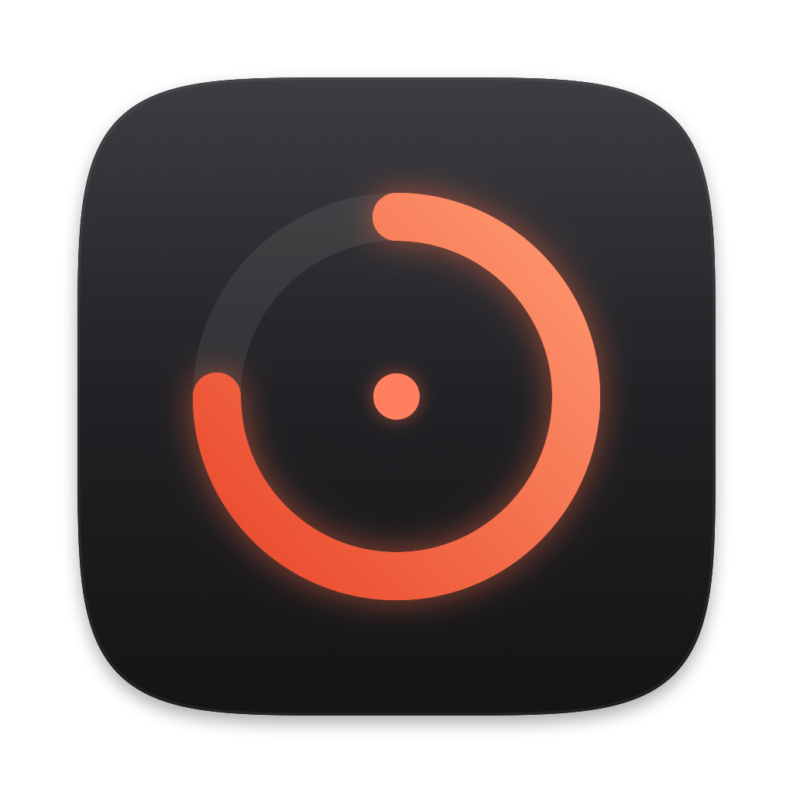
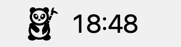
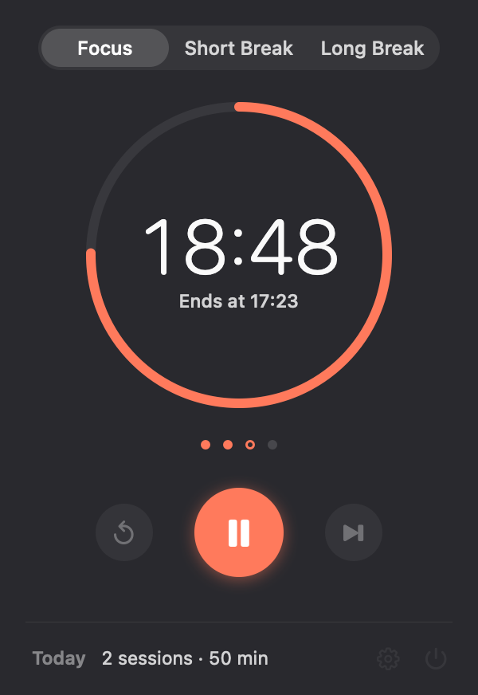
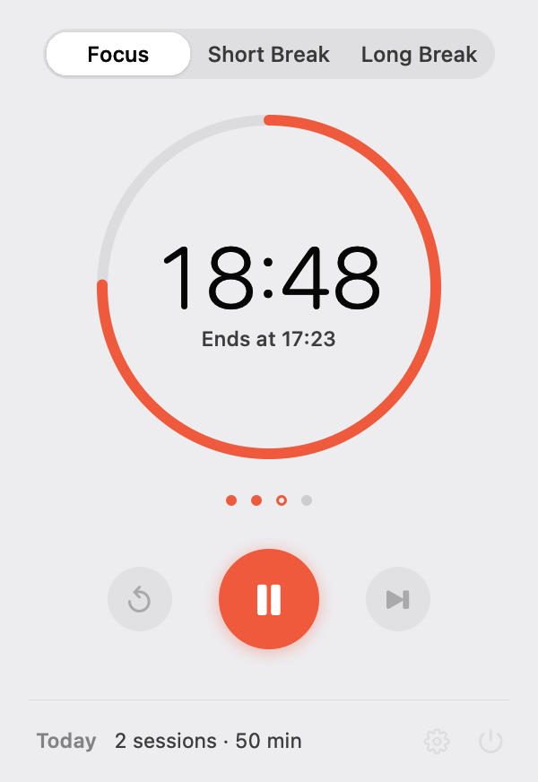
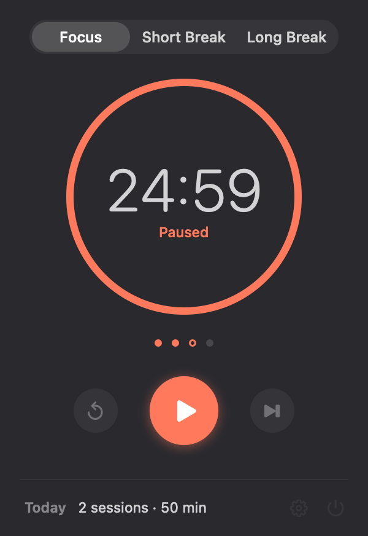
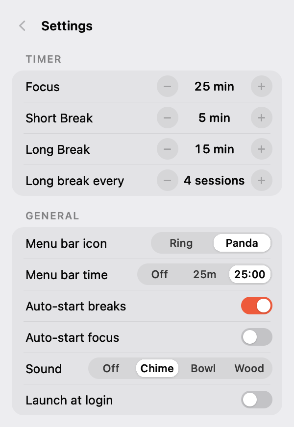
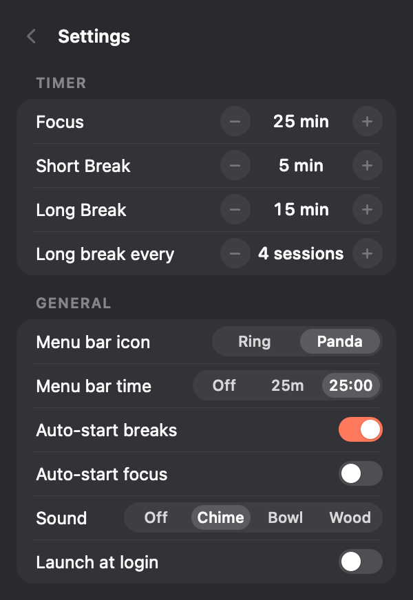
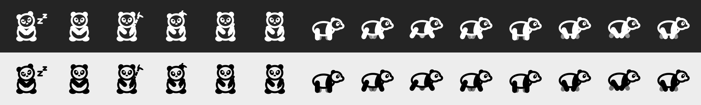
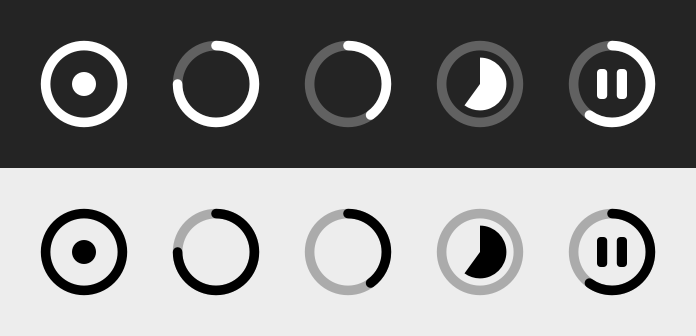
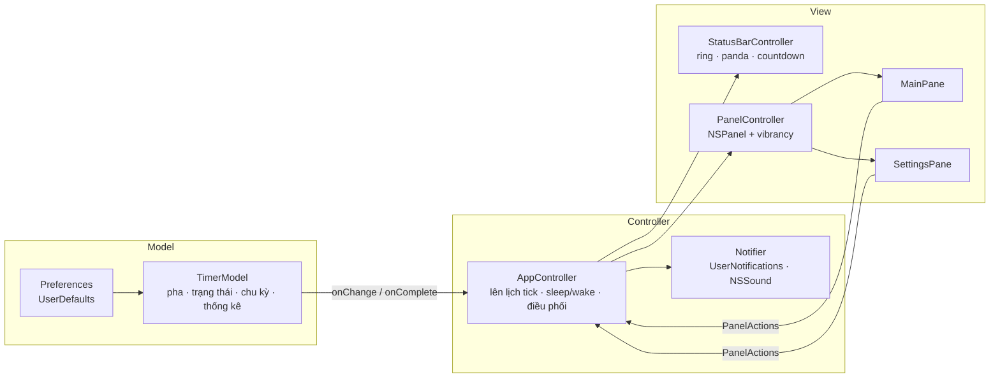

<p align="center">
  
</p>

<h1 align="center">Still</h1>

<p align="center">
  Pomodoro timer tối giản cho thanh menu macOS, có một chú gấu trúc nhai tre trong lúc bạn tập trung.<br>
  AppKit thuần · binary 276 KB · RAM ~13 MB · gần như 0% CPU
</p>

<p align="center">
  
  &nbsp;&nbsp;
  
</p>

<p align="center">
  
  &nbsp;
  
</p>

---

## Mục lục

- [Tính năng](#tính-năng)
- [Cài đặt](#cài-đặt)
- [Hướng dẫn sử dụng](#hướng-dẫn-sử-dụng)
- [Gấu trúc trên thanh menu](#gấu-trúc-trên-thanh-menu)
- [Kiến trúc](#kiến-trúc)
- [Tech stack](#tech-stack)
- [Hiệu năng](#hiệu-năng)
- [Cấu trúc thư mục](#cấu-trúc-thư-mục)
- [Phát triển](#phát-triển)

## Tính năng

- **Chu kỳ Pomodoro đầy đủ:** Focus, Nghỉ ngắn, Nghỉ dài. Cứ sau N phiên Focus thì có một lần nghỉ dài (mặc định 25 / 5 / 15 phút, nghỉ dài sau 4 phiên).
- **Thanh menu linh hoạt:** chọn icon (vòng tiến độ hoặc gấu trúc), và chọn cách hiện giờ: ẩn, `25m` hoặc `25:00`.
- **Gấu trúc đồng hành:** hành vi đổi theo từng pha. Cây tre ngắn dần theo thời gian còn lại, nên chú gấu cũng là một thanh tiến độ.
- **Thông báo và âm báo:** thông báo hệ thống khi hết phiên, kèm 3 bộ âm tự tổng hợp (Chime, Bowl, Wood), bấm chọn là nghe thử ngay.
- **Tự động bắt đầu** giờ nghỉ hoặc phiên Focus tiếp theo (tuỳ chọn).
- **Thống kê trong ngày:** số phiên đã hoàn thành và tổng thời gian tập trung.
- **Giữ trạng thái:** thoát app giữa phiên rồi mở lại vẫn chạy tiếp.
- **Launch at login**, chế độ sáng/tối, tiếng Việt và tiếng Anh (tự chọn theo ngôn ngữ hệ thống).
- **Phím tắt** cho mọi thao tác.

## Cài đặt

Yêu cầu: macOS 14 trở lên và Xcode Command Line Tools (`xcode-select --install`). Không cần Xcode.

```sh
git clone git@github.com:oornasp/still.git
cd still
./build.sh install      # build, copy vào /Applications và chạy
```

Các tuỳ chọn khác:

```sh
./build.sh              # chỉ build vào build/Still.app
./build.sh run          # build và chạy từ thư mục build
UNIVERSAL=1 ./build.sh  # binary chạy được trên cả Apple Silicon lẫn Intel
```

Lần đầu mở, macOS sẽ hỏi quyền gửi thông báo. Nếu bạn từ chối, app vẫn phát âm báo khi hết giờ.

## Hướng dẫn sử dụng

### Thanh menu

| Thao tác | Kết quả |
|---|---|
| Click vào icon | Mở hoặc đóng panel |
| Click phải (hoặc Control-click) | Menu nhanh: Bắt đầu/Tạm dừng, Đặt lại, Bỏ qua, Cài đặt, Thoát |

### Panel chính



- **Bộ chọn pha** ở trên cùng: Focus, Short Break, Long Break.
- **Vòng tiến độ** rút dần ngược chiều kim đồng hồ khi thời gian trôi. Bên trong là số phút còn lại, kèm dòng phụ: *"Ends at 17:23"* khi đang chạy, *"Paused"* khi tạm dừng, *"Space to start"* khi chưa bắt đầu.
- **Các chấm** cho biết đã xong mấy phiên Focus trong chu kỳ hiện tại. Chấm viền là phiên đang chạy.
- **Ba nút:** Đặt lại · Bắt đầu/Tạm dừng · Bỏ qua sang pha tiếp theo.
- **Chân panel:** thống kê hôm nay, nút Cài đặt và nút Thoát.

<br clear="right">

### Phím tắt (khi panel đang mở)

| Phím | Tác dụng |
|---|---|
| `Space` | Bắt đầu / tạm dừng |
| `R` | Đặt lại phiên hiện tại |
| `S` | Bỏ qua sang pha tiếp theo |
| `1` `2` `3` | Chuyển sang Focus / Nghỉ ngắn / Nghỉ dài |
| `⌘,` | Mở/đóng Cài đặt |
| `Esc` | Đóng panel (hoặc quay lại từ Cài đặt) |
| `⌘W` / `⌘Q` | Đóng panel / Thoát app |

### Cài đặt

<p>
  
  &nbsp;
  
</p>

| Mục | Giá trị |
|---|---|
| Focus / Short Break / Long Break | 5–120 / 1–30 / 5–60 phút |
| Long break every | Sau 2–8 phiên Focus |
| Menu bar icon | **Ring** (vòng tiến độ) hoặc **Panda** |
| Menu bar time | **Off** (chỉ icon) · **25m** · **25:00** |
| Auto-start breaks / focus | Tự chạy pha kế tiếp khi hết giờ |
| Sound | **Off** · **Chime** (chuông trong) · **Bowl** (chuông xoay, ngân dài) · **Wood** (gõ mõ gỗ) |
| Launch at login | Mở app khi đăng nhập (nên cài vào /Applications trước) |

Mỗi bộ âm có hai biến thể: chuỗi nốt **đi xuống** khi hết Focus (đến lúc thả lỏng) và **đi lên** khi hết giờ nghỉ (quay lại tập trung).

### Thông báo

- Hết Focus: *"Focus complete: Nice work. Take a 5-minute break."*
- Hết giờ nghỉ: *"Break's over: Ready for the next focus session?"*
- Click vào thông báo để mở panel. Lúc bấm Start không có thông báo, vì bạn vừa tự bấm.
- App tôn trọng chế độ Focus/Do Not Disturb của macOS.

## Gấu trúc trên thanh menu



Từ trái sang phải: ngủ gật · chờ · nhai tre (tre đầy, đang gặm, còn một nửa, sắp hết) · 8 khung hình chạy lon ton.

| Trạng thái | Gấu trúc làm gì | Lý do |
|---|---|---|
| Rảnh | Ngồi ngủ gật, có chữ "z" | Chưa có việc gì |
| Tạm dừng | Ngồi khoanh tay chờ | Đang chờ bạn quay lại |
| **Focus** | Ngồi yên nhai tre, thỉnh thoảng gặm một miếng và chớp mắt | Vật chuyển động ở rìa tầm mắt gây xao nhãng, nên lúc tập trung gấu gần như bất động ("Still"). **Cây tre ngắn dần** theo thời gian còn lại |
| **Nghỉ** | Chạy lon ton | Giờ nghỉ là giờ chơi |

Về đồ hoạ: icon trên menubar chỉ có một màu, nên lông trắng được vẽ bằng nét viền, còn các mảng đen (tai, mảng mắt, tay chân, dải vai) được tô đặc. Mọi tư thế đều vẽ bằng code (vector, rasterize một lần ở độ phân giải Retina) và tự đổi màu theo thanh menu sáng/tối.

Không thích gấu? Chọn **Ring** để quay về vòng tiến độ tối giản:



## Kiến trúc



### Các nguyên tắc chính

1. **Model không cần tick.** `TimerModel` chỉ lưu mốc kết thúc tuyệt đối (`running(end: Date)`). Thời gian còn lại luôn được *tính ra*, nên không có biến đếm nào bị lệch, kể cả qua lúc máy ngủ hay đổi giờ hệ thống.

2. **Chỉ thức dậy khi có thứ cần đổi trên màn hình.** `AppController.reschedule()` tính thời điểm *gần nhất* mà một chi tiết hiển thị sẽ thay đổi, rồi đặt **một timer one-shot** đúng lúc đó:
   - chữ số giây đổi (khi menubar hiện `25:00` hoặc panel đang mở), hoặc
   - chữ số phút đổi (khi hiện `25m`), hoặc
   - icon sang bước tiến độ tiếp theo (48 bước với Ring, 6 bước với cây tre), hoặc
   - phiên kết thúc.

   Khi tạm dừng hoặc rảnh thì không có timer nào. Khi màn hình tắt, app chỉ thức dậy đúng lúc phiên kết thúc.

3. **Thông báo do hệ thống lên lịch.** Ngay khi phiên bắt đầu, `Notifier` đăng ký một `UNTimeIntervalNotificationTrigger`, nên thông báo vẫn đến đúng giờ kể cả khi app bị App Nap. Pause, Reset hay Skip sẽ huỷ thông báo đó. Riêng lúc phiên tự kết thúc thì không huỷ, tránh trường hợp timer của app chạy trước hệ thống vài mili giây và vô tình xoá mất thông báo.

4. **Hoạt ảnh chạy trong render server.** Gấu trúc là một `CALayer` được mask bằng các khung hình, lật khung bằng `CAKeyframeAnimation` (chế độ discrete). Tiến trình Still không thức dậy lần nào cho mỗi khung hình. Hoạt ảnh tự gỡ khi thanh menu bị che (app toàn màn hình) hoặc màn hình tắt.

5. **Panel được dựng một lần và tái sử dụng.** `NSPanel` dạng borderless + non-activating: nhận bàn phím mà không cướp focus của app đang dùng. Cửa sổ được giữ lại để ẩn/hiện thay vì tạo mới mỗi lần, vì tạo lại liên tục làm WindowServer phải cấp surface mới và heap bị phân mảnh.

6. **Ưu tiên layer, tránh `draw(_:)`.** Ring là `CAShapeLayer`, các nút và thẻ là `CALayer` tô màu. Chỉ các thành phần tĩnh nhỏ mới vẽ bằng CPU.

## Tech stack

| Thành phần | Công nghệ |
|---|---|
| Ngôn ngữ | Swift 6.4 (language mode 5) |
| UI | **AppKit thuần** (`NSStatusItem`, `NSPanel`, `NSVisualEffectView`), không SwiftUI |
| Đồ hoạ và hoạt ảnh | Core Animation (`CAShapeLayer`, `CAKeyframeAnimation`, `CASpringAnimation`), Core Graphics |
| Thông báo | UserNotifications |
| Âm thanh | `NSSound`; file `.caf` tự tổng hợp bằng script Swift (cộng các partial sóng sin, bao biên độ tắt dần theo hàm mũ) |
| Đăng nhập tự mở | ServiceManagement (`SMAppService`) |
| Lưu trữ | `UserDefaults` |
| Bản địa hoá | `Localizable.strings` (en, vi) |
| Build | `swiftc` + shell script, ký ad-hoc. Không cần Xcode project hay Swift Package |
| Phụ thuộc bên ngoài | **Không có** |

## Hiệu năng

Đo trên MacBook M5 Pro, macOS 27, bằng `footprint` (cũng là cột "Memory" trong Activity Monitor) và `ps -o cputime`:

| Trạng thái | RAM | CPU |
|---|---|---|
| Rảnh, panel đóng | 12–13 MB | 0% |
| Đang đếm ngược, menubar hiện `25:00` | 12–13 MB | 0.00 s CPU trong 60 s |
| Gấu trúc nhai tre / chạy | 13 MB | 0.00 s CPU trong 30 s |
| Panel đang mở | 18–20 MB | ~0% |

Để so sánh: một app AppKit trống chỉ có status item đã chiếm 11–12 MB.

<details>
<summary>Những gì đã đo và tối ưu trong quá trình làm</summary>

| Vấn đề phát hiện | Nguyên nhân | Cách sửa | Kết quả |
|---|---|---|---|
| Footprint tăng vọt lên 97 MB mỗi khi mở Settings | `CardView` vẽ bằng `draw(_:)` bị kéo theo animation trượt kèm đổi alpha, WindowServer cấp ~69 MB surface | Dựng thẻ hoàn toàn bằng layer tô màu | Ổn định 18–20 MB |
| Footprint sau nhiều lần mở/đóng panel lên 24–27 MB | Tạo/huỷ `NSPanel` liên tục làm phân mảnh heap | Dựng panel một lần và tái sử dụng | Ổn định 19 MB |
| Gấu chạy tốn 4.4% CPU | Mỗi lần đổi ảnh `NSStatusItem` (10 fps) AppKit phải layout lại; rasterize sẵn cũng không đỡ | Chuyển sang `CAKeyframeAnimation` trên layer mask | ~0% |
| Panel Liquid Glass khó đọc | `NSGlassEffectView` gần như không làm mờ nền phía sau | Dùng `NSVisualEffectView` (material popover) | Chữ rõ trên mọi nền |
| Click vào bộ chọn không có tác dụng | Nhãn `NSTextField` nuốt mất mouse event | Override `hitTest` của `PillSelector` | Click hoạt động |

</details>

## Cấu trúc thư mục

```
Sources/
  main.swift                 điểm vào, NSApplication dạng .accessory
  AppController.swift        điều phối: lên lịch tick, thông báo, sleep/wake, menu chuột phải
  TimerModel.swift           pha, trạng thái, chu kỳ Pomodoro, thống kê, lưu/khôi phục
  Preferences.swift          cài đặt (UserDefaults), MenuBarIcon, SoundTheme, SMAppService
  StatusBarController.swift  status item: icon vòng, hoạt ảnh gấu trúc, chữ đếm ngược
  Companion.swift            vẽ gấu trúc bằng code: các tư thế và chuỗi khung hình
  Panel.swift                NSPanel, chuyển màn, bàn phím
  MainPane.swift             màn hình timer
  SettingsPane.swift         màn hình cài đặt
  Components.swift           RingView, PrimaryButton, CircleButton, PillSelector, Toggle, ValueStepper...
  Notifier.swift             UserNotifications và âm báo dự phòng
  Theme.swift                màu, font, format, bản địa hoá
Resources/
  Info.plist                 LSUIElement (ẩn khỏi Dock), bundle id com.oorn.still
  AppIcon.icns               icon, sinh từ scripts/make_icon.swift
  *.caf                      3 bộ âm × 2 biến thể, sinh từ scripts/make_sounds.swift
  en.lproj, vi.lproj         chuỗi giao diện
scripts/
  make_icon.swift            vẽ app icon và đóng gói .icns
  make_sounds.swift          tổng hợp âm Chime / Bowl / Wood
tools/
  snapshot.sh, main.swift    render các màn hình và icon ra PNG (dùng cho README và soát UI)
docs/                        icon và ảnh chụp màn hình
build.sh                     build, ký, cài đặt
```

## Phát triển

```sh
./build.sh run                        # build và chạy thử
./tools/snapshot.sh docs/screenshots  # render lại ảnh chụp màn hình
swift scripts/make_icon.swift Resources
swift scripts/make_sounds.swift Resources
```

Dữ liệu người dùng nằm ở `~/Library/Preferences/com.oorn.still.plist`. Muốn đặt lại toàn bộ:

```sh
defaults delete com.oorn.still
```
